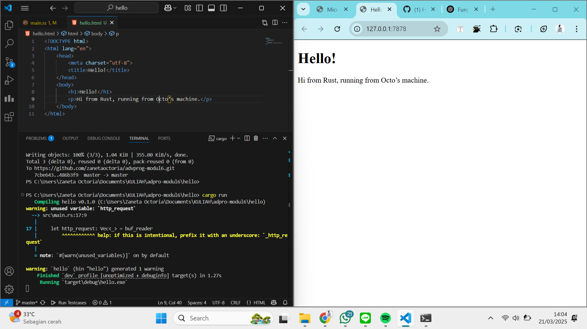
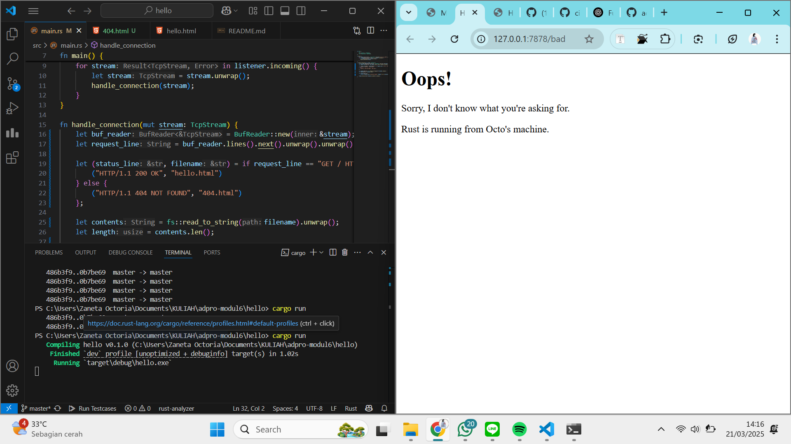

## (1) Commit 1 : `handle_connection`

Fungsi `handle_connection` digunakan untuk menangani permintaan dari klien, yaitu koneksi TCP yang diterima melalui `TcpListener`.

```rust
fn handle_connection(mut stream: TcpStream) {
```
Kode di atas menunjukkan bahwa fungsi ini menerima parameter `TcpStream`, yang merepresentasikan koneksi aktif antara server dan klien. Kata kunci `mut` menunjukkan bahwa `stream` akan dimodifikasi di dalam fungsi.

```rust
let buf_reader = BufReader::new(&mut stream);
```
Di sini, `BufReader` digunakan untuk membaca data dari `stream` secara lebih efisien, baris demi baris. Selain itu, `BufReader` membungkus `TcpStream`, sehingga mempermudah pembacaan permintaan HTTP.

```rust
let http_request: Vec<_> = buf_reader 
    .lines()
    .map(|result| result.unwrap()) 
    .take_while(|line| !line.is_empty()) 
    .collect();
```
- `buf_reader.lines()` mengembalikan iterator untuk membaca koneksi satu per satu dalam bentuk baris.  
- `.map(|result| result.unwrap())` mengekstrak nilai `String` dari `Result<String, Error>`.  
- `.take_while(|line| !line.is_empty())` berhenti membaca saat menemukan baris kosong.  
- `.collect()` mengumpulkan semua baris yang telah dibaca ke dalam `Vec<String>`.  

```rust
println!("Request: {:#?}", http_request);
```
Setelah itu, isi permintaan HTTP dicetak dalam format debug untuk mempermudah proses debugging.

## (2) Commit 2 : `new handle_connection`
Setelah dilakukan perubahan, fungsi `handle_connection` kini mampu membaca permintaan HTTP dan mengembalikan respons berupa file HTML.

---
**Perubahan yang ditambahkan dalam kode:**  
```rust
let status_line = "HTTP/1.1 200 OK";  
let contents = fs::read_to_string("hello.html").unwrap();  
let length = contents.len();  
```
- `status_line = "HTTP/1.1 200 OK"` menetapkan status HTTP dalam respons, di mana `200 OK` menunjukkan bahwa permintaan berhasil diproses.  
- `fs::read_to_string("hello.html").unwrap()` mengambil isi file `hello.html`, dan jika file tidak ditemukan, `unwrap()` akan menyebabkan program berhenti dengan error.  
- `length = contents.len();` menghitung ukuran file dalam satuan byte.  

---
```rust
let response =  
    format!("{status_line}\r\nContent-Length: {length}\r\n\r\n{contents}");  
```
Kode ini menyusun format respons HTTP yang akan dikirimkan ke klien.

---
```rust
stream.write_all(response.as_bytes()).unwrap();
```
Bagian ini mengubah respons menjadi byte dan mengirimkannya melalui `TcpStream`, sehingga klien dapat menerimanya.



## (3) Commit 3  : Cara Memisahkan Respons  
Pemilahan respons dilakukan berdasarkan tiga elemen utama dalam HTTP Headers: metode permintaan (`request method`), path, dan versi HTTP. Berikut adalah potongan kode yang mengatur pemisahan tersebut:  

```rust
let (status_line, filename) = if request_line == "GET / HTTP/1.1" {
    ("HTTP/1.1 200 OK", "hello.html")
} else {
    ("HTTP/1.1 404 NOT FOUND", "404.html")
};
```
Kode ini menentukan respons berdasarkan `request_line`. Jika permintaan adalah `"GET / HTTP/1.1"`, maka halaman utama (`hello.html`) akan ditampilkan. Jika permintaan mengarah ke path lain yang tidak dikenali, server akan mengembalikan halaman error (`404.html`).  

### Mengapa Refactoring Diperlukan?  
Refactoring dilakukan untuk meningkatkan keterbacaan dan struktur kode tanpa mengubah fungsinya. Pada tahap ini, refactoring bertujuan untuk menghindari kode yang berulang—misalnya, dalam mendefinisikan `status_line`, menghitung `Content-Length`, dan sebagainya. Dengan perubahan ini, kode menjadi lebih bersih, lebih mudah dipahami, serta lebih fleksibel untuk pemeliharaan dan pengembangan di masa mendatang.


